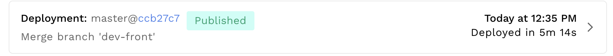

# A Decentralized M&A Protocol 

DAO to DAO merge framework powered by sequential bargaining
Select, Bargain, Merge.
Stronger Together 

The possiblity are limitless, doing that with more than 2 communities, doing that in a cross chain way on different blockchain. Or could applied itself on Multisig usecases for example with Gnosis Safe on Gnosis Chain. Today our protocol MVP is compatible with every EVM chain, polygon, Celo, cronos, Gnosis chain, Cosmos, Ethereum. Merger and acquisition are a way to make other communities and guild to come on their blockchain.

We can use a dispute resolution system, Kleros, to prevent / solve not planned issues.
	

## Demo vidéo

👆 Click on the image to start the video

👆 Click on the image to start the video

## Deployment smart contract address:

### Polygon Testnet (Mumbai network): 
- DAO A: 0x3D0464427641CA176F3F30c2fB8576f275eB8C18
- DAO B: 0xcf619aA5F2eE6768eA19D0d47b17A7371489AE99
- SNF: 0x3e43C29E773588865d6742186CE18aEf15A9EE81

### Celo test network: 
- DAO A: 0x3D0464427641CA176F3F30c2fB8576f275eB8C18
- DAO B: 0xcf619aA5F2eE6768eA19D0d47b17A7371489AE99
- SNF: 0xFf0E9E825C72b1891dD2f7b19Ba062460210f383
- DAO C: 0x5d7AA0293AAb074657cE444dE93bE4370431e3C9

### Gnosis sokol network:
- DAO A: 0x0d5A4E9a9f61841594355623E47482f5b6FD75Cd
- DAO B: 0x3D0464427641CA176F3F30c2fB8576f275eB8C18
- SNF: 0x2fe807C71A067a75Acb5dbE621EDa67093E1Bbaa
- DAO C: 0x2fe807C71A067a75Acb5dbE621EDa67093E1BC91

### Rinkeby network: 
- DAO A: 0x0d5A4E9a9f61841594355623E47482f5b6FD75Cd
- DAO B: 0x3D0464427641CA176F3F30c2fB8576f275eB8C18
- SNF: 0x2fe807C71A067a75Acb5dbE621EDa67093E1Bbaa
- DAO C: 0xA12B4cB6915e5C236a4FB09cB12d130C06ACC4b8

### Cronos test network: 
- DAO A: 0x0d5A4E9a9f61841594355623E47482f5b6FD75Cd
- DAO B: 0x3D0464427641CA176F3F30c2fB8576f275eB8C18
- SNF: 0x2fe807C71A067a75Acb5dbE621EDa67093E1Bbaa
- DAO C: 0xA12B4cB6915e5C236a4FB09cB12d130C06ACC4b8

## Whitepaper:
[Junction, the web3 M&A Protocol.pdf](https://github.com/NandyBa/Junction/files/9175528/Junction.the.web3.M.A.Protocol.pdf)

## Presentation:
[Powerpoint presentation.pdf](Junction%20powerpoint%20presentation.pdf)

## Deployed on IPFS using Fleek

## Run scripts

In the project directory, you can run:

### `yarn start`

Runs the app in the development mode.\
Open [http://localhost:3000](http://localhost:3000) to view it in the browser.

The page will reload if you make edits.\
You will also see any lint errors in the console.

## Make an inter DAO proposal

Go to [http://localhost:3000/merge-room](http://localhost:3000/merge-room) to create a merge DAO proposal.
The submission of the proposal is gas less. App use wallet signature to prove the proposal ownership authenticity.

Required fiels are:
	- Title
	- DAO 0 gouvernance token address
	- DAO 0 blockchain
	- DAO 1 gouvernance token address
	- DAO 1 blockchain
	- Proposal description

	
